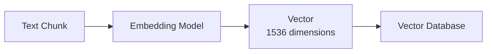

## What are Embeddings?

**Embeddings** are numerical representations (vectors) that capture the semantic meaning of text. Similar content has similar vectors, enabling semantic search.



## How Embeddings Enable Search

<Steps>
  <Step title="Document Ingestion">
    Each chunk is converted to a vector and stored
  </Step>
  <Step title="Query Processing">
    User's search query is converted to a vector
  </Step>
  <Step title="Similarity Search">
    Database finds vectors closest to the query
  </Step>
  <Step title="Results">
    Matching chunks are returned with similarity scores
  </Step>
</Steps>

## Supported Embedding Models

| Model | Dimensions | Best For | Cost |
|-------|------------|----------|------|
| `text-embedding-3-small` | 1536 | General use | $0.02/1M tokens |
| `text-embedding-3-large` | 3072 | High accuracy | $0.13/1M tokens |

## Configuration

### Environment Variables

```env
OPENAI_API_KEY=sk-your-api-key
OPENAI_EMBEDDING_MODEL=text-embedding-3-small
```

### Creating Embedding Config

```bash
curl -X POST http://localhost:3000/api/v2/ai-models/configs \
  -H "Authorization: Bearer YOUR_JWT_TOKEN" \
  -H "Content-Type: application/json" \
  -d '{
    "name": "Standard Embeddings",
    "aiModelId": "embedding-model-uuid",
    "config": {
      "dimensions": 1536
    }
  }'
```

## Vector Storage

IngestIQ uses **PostgreSQL with pgvector** for efficient vector storage and search.

### HNSW Indexing

Hierarchical Navigable Small World (HNSW) indexing provides:
- **Fast approximate nearest neighbor search**
- **Sub-millisecond query times**
- **Scalable to millions of vectors**

### Storage Requirements

| Dimensions | Size per Vector | 100K Documents |
|------------|-----------------|----------------|
| 1536 | ~6KB | ~600MB |
| 3072 | ~12KB | ~1.2GB |

## Similarity Search

### Search Request

```bash
curl -X POST http://localhost:3000/api/v2/documents/search \
  -H "Authorization: Bearer YOUR_JWT_TOKEN" \
  -H "Content-Type: application/json" \
  -d '{
    "knowledgebaseId": "kb-uuid",
    "query": "How to configure authentication?",
    "topK": 5
  }'
```

### Understanding Scores

| Score Range | Interpretation |
|-------------|----------------|
| 0.90 - 1.00 | Very high relevance |
| 0.75 - 0.89 | High relevance |
| 0.60 - 0.74 | Moderate relevance |
| 0.40 - 0.59 | Low relevance |
| < 0.40 | Minimal relevance |

<Note>
  Similarity scores are cosine similarity values. Higher = more similar.
</Note>

## Choosing Dimensions

<Tabs>
  <Tab title="1536 Dimensions (Small)">
    **Recommended for most use cases**
    
    ✅ Faster search
    ✅ Lower storage
    ✅ Cost-effective
    ✅ Good accuracy
    
    Best for:
    - General documentation
    - FAQs and support content
    - Standard enterprise search
  </Tab>
  <Tab title="3072 Dimensions (Large)">
    **For high-precision needs**
    
    ✅ Better nuance detection
    ✅ Higher accuracy
    ❌ More storage
    ❌ Higher cost
    
    Best for:
    - Legal documents
    - Research papers
    - Highly technical content
  </Tab>
</Tabs>

## Best Practices

<AccordionGroup>
  <Accordion title="Use consistent dimensions">
    All documents in a Knowledge Base should use the same embedding dimensions. Mixing causes search issues.
  </Accordion>
  
  <Accordion title="Start with small model">
    Begin with text-embedding-3-small. Only upgrade if search quality is insufficient.
  </Accordion>
  
  <Accordion title="Monitor embedding costs">
    Large document sets can accumulate costs. Monitor usage in the AI usage logs.
  </Accordion>
  
  <Accordion title="Consider chunk size impact">
    Smaller chunks = more embeddings = higher cost but more precise search.
  </Accordion>
</AccordionGroup>

## Performance Optimization

### Query Tips

- Use natural language queries (not keywords)
- Be specific about what you're looking for
- Include context in your queries

### Index Optimization

pgvector HNSW indexes are configured automatically. For very large datasets:

```sql
-- Adjust for accuracy/speed tradeoff
ALTER INDEX embeddings_idx SET (ef_construction = 128);
```

## Related

<CardGroup cols={2}>
  <Card title="AI Models" icon="wand-magic-sparkles" href="/ai-processing/ai-models">
    Available models
  </Card>
  <Card title="Search API" icon="magnifying-glass" href="/api-reference/search">
    Search endpoint docs
  </Card>
</CardGroup>
