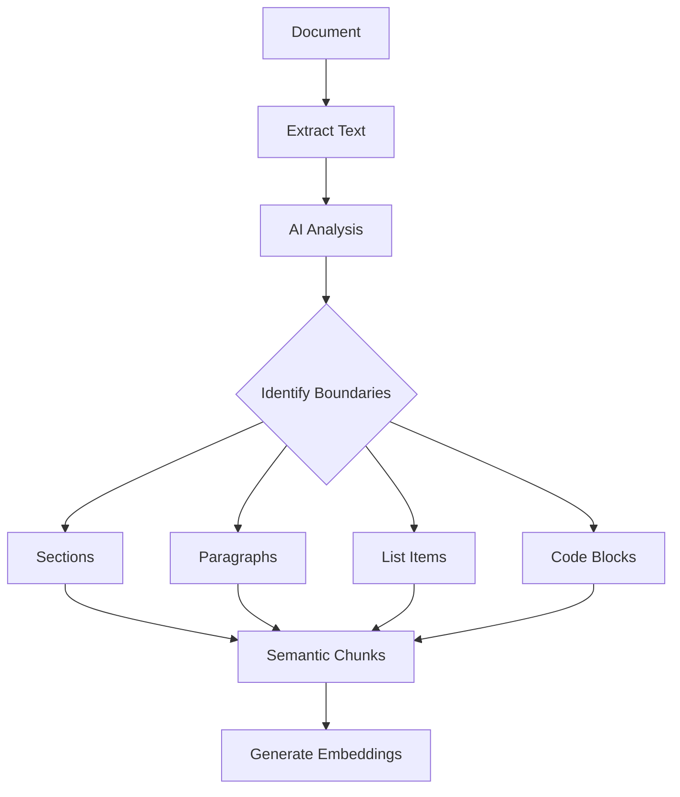

## What is Semantic Chunking?

**Semantic chunking** is an AI-powered technique that splits documents based on meaning and context rather than arbitrary character counts.

<CardGroup cols={2}>
  <Card title="Context-Aware" icon="brain">
    Understands document structure
  </Card>
  <Card title="Preserve Meaning" icon="link">
    Keeps related content together
  </Card>
</CardGroup>

## Traditional vs Semantic Chunking

<Tabs>
  <Tab title="Traditional (Fixed Size)">
    ```
    Chunk 1: "...authentication is configured by set"
    Chunk 2: "ting the JWT_SECRET environment variabl"
    Chunk 3: "e. Make sure to use a secure random..."
    ```
    
    <IconCross /> Breaks sentences mid-word
    <IconCross /> Loses context
    <IconCross /> Poor search results
  </Tab>
  <Tab title="Semantic (IngestIQ)">
    ```
    Chunk 1: "Authentication is configured by setting 
              the JWT_SECRET environment variable. 
              Make sure to use a secure random string."
    
    Chunk 2: "Authorization uses role-based access 
              control (RBAC) with three levels..."
    ```
    
    <IconCheck /> Complete sentences
    <IconCheck /> Coherent topics
    <IconCheck /> Better search results
  </Tab>
</Tabs>

## How It Works



1. **Extract**: Raw text is extracted from the document
2. **Analyze**: AI model analyzes structure and content
3. **Identify**: Natural boundaries are detected
4. **Chunk**: Content is split at meaningful points
5. **Embed**: Each chunk becomes a vector

## AI-Powered Features

### Structure Recognition

- **Headers and sections**
- **Paragraphs and topics**
- **Lists and enumerations**
- **Code blocks**
- **Tables and data**
- **Quotes and citations**

### Context Preservation

- Complete sentences are kept together
- Related paragraphs are grouped
- Code with its explanation
- Tables with headers

## Custom Parsing Prompts

Control how the AI chunks your documents:

### Basic Parsing Prompt

```json
{
  "parsingPrompt": "Extract the content and split into logical sections. Keep code examples with their explanations."
}
```

### Technical Documentation

```json
{
  "parsingPrompt": "Parse this technical document:
1. Preserve all code blocks exactly as written
2. Keep function documentation with the code
3. Group related concepts together
4. Extract step-by-step instructions as separate chunks"
}
```

### Legal Documents

```json
{
  "parsingPrompt": "Parse this legal document:
1. Keep each clause complete
2. Preserve section numbering
3. Extract definitions with their explanations
4. Identify key obligations and requirements"
}
```

### Research Papers

```json
{
  "parsingPrompt": "Parse this research paper:
1. Keep abstracts as single chunks
2. Preserve methodology descriptions completely
3. Keep findings with supporting data
4. Extract citations and references"
}
```

## Chunk Size Considerations

### Optimal Chunk Sizes

| Content Type | Recommended Size | Rationale |
|--------------|------------------|-----------|
| General docs | 500-1000 tokens | Balance context and precision |
| Technical docs | 300-500 tokens | More granular for specific queries |
| Legal | 200-400 tokens | Clause-level retrieval |
| Long-form | 800-1200 tokens | Maintain narrative flow |

### Factors Affecting Size

- **Search precision**: Smaller = more precise matches
- **Context**: Larger = more context per result
- **Storage**: More chunks = more vectors
- **Cost**: More chunks = more embeddings

## Best Practices

<AccordionGroup>
  <Accordion title="Match prompts to document type">
    Use specialized parsing prompts for different document types:
    - Technical: Focus on code preservation
    - Legal: Focus on clause boundaries
    - Marketing: Focus on key messages
  </Accordion>
  
  <Accordion title="Test with sample documents">
    Run test ingestions and review chunks before processing large batches.
  </Accordion>
  
  <Accordion title="Iterate on prompts">
    Refine parsing prompts based on search quality results.
  </Accordion>
</AccordionGroup>

## Viewing Chunks

After processing, you can see how documents were chunked:

```bash
curl http://localhost:3000/api/v2/knowledgebases/{kbId}/documents/{docId}/chunks \
  -H "Authorization: Bearer YOUR_JWT_TOKEN"
```

## Related

<CardGroup cols={2}>
  <Card title="Custom Prompts" icon="wand-magic-sparkles" href="/ai-processing/custom-prompts">
    Advanced prompt engineering
  </Card>
  <Card title="Embeddings" icon="cube" href="/ai-processing/embeddings">
    Vector generation
  </Card>
</CardGroup>
