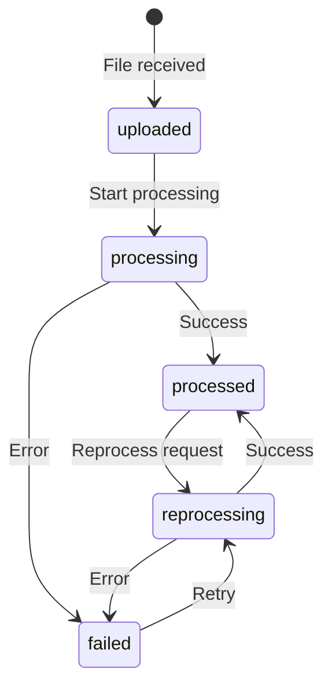

## What is a Document?

A **Document** represents a file that has been ingested into a Knowledge Base. Documents go through a processing lifecycle that transforms them from raw files into searchable, AI-ready content.

## Document Lifecycle



## Document Status

| Status | Description |
|--------|-------------|
| `uploaded` | File received, awaiting processing |
| `processing` | Currently being parsed and embedded |
| `processed` | Successfully processed and searchable |
| `failed` | Processing failed (check metadata for error) |
| `reprocessing` | Being reprocessed |

## Document Properties

| Property | Type | Description |
|----------|------|-------------|
| `id` | UUID | Unique identifier |
| `fileId` | String | Storage file identifier |
| `knowledgebaseId` | UUID | Parent Knowledge Base |
| `pipelineId` | UUID | Pipeline that created this document |
| `filename` | String | Original filename |
| `author` | String | Document author (if extracted) |
| `size` | Integer | File size in bytes |
| `pageCount` | Integer | Number of pages (for PDFs) |
| `status` | Enum | Processing status |
| `metadata` | Object | Extracted and custom metadata |

## Processing Flow

When a document is processed, IngestIQ:

<Steps>
  <Step title="Upload & Store">
    File is uploaded and stored in S3/MinIO
  </Step>
  <Step title="Text Extraction">
    Content is extracted from the file format (PDF, CSV, etc.)
  </Step>
  <Step title="Semantic Chunking">
    AI splits content into meaningful chunks
  </Step>
  <Step title="Metadata Extraction">
    Optional: Extract structured metadata (title, author, dates)
  </Step>
  <Step title="Embedding Generation">
    Each chunk is converted to a vector embedding
  </Step>
  <Step title="Vector Storage">
    Embeddings are stored in pgvector for search
  </Step>
</Steps>

## Listing Documents

```bash
curl http://localhost:3000/api/v2/knowledgebases/{kbId}/documents \
  -H "Authorization: Bearer YOUR_JWT_TOKEN"
```

### Response

```json
{
  "documents": [
    {
      "id": "doc-uuid",
      "filename": "product-guide.pdf",
      "status": "processed",
      "size": 1048576,
      "pageCount": 25,
      "metadata": {
        "title": "Product Guide",
        "author": "Engineering Team"
      },
      "createdAt": "2024-01-28T12:00:00.000Z"
    }
  ],
  "pagination": {
    "page": 1,
    "limit": 20,
    "total": 150
  }
}
```

## Searching Documents

Perform semantic search across your Knowledge Base:

```bash
curl -X POST http://localhost:3000/api/v2/documents/search \
  -H "Authorization: Bearer YOUR_JWT_TOKEN" \
  -H "Content-Type: application/json" \
  -d '{
    "knowledgebaseId": "kb-uuid",
    "query": "How do I configure authentication?",
    "topK": 10
  }'
```

### Search Response

```json
{
  "results": [
    {
      "documentId": "doc-uuid",
      "filename": "auth-guide.pdf",
      "content": "Authentication is configured by setting...",
      "score": 0.89,
      "metadata": {
        "page": 5,
        "section": "Configuration"
      }
    }
  ]
}
```

## Reprocessing Documents

Reprocess a document to apply updated parsing or embedding models:

```bash
curl -X POST http://localhost:3000/api/v2/knowledgebases/{kbId}/documents/{docId}/reprocess \
  -H "Authorization: Bearer YOUR_JWT_TOKEN"
```

<Note>
  Reprocessing re-runs the entire pipeline for the document. Previous embeddings are replaced.
</Note>

## Document Metadata

Metadata is stored as a flexible JSON object containing:

### Automatic Metadata
- `processingStarted` - When processing began
- `processingCompleted` - When processing finished
- `error` - Error message (if failed)

### Extracted Metadata (if enabled)
- `title` - Document title
- `author` - Document author
- `keywords` - Extracted keywords
- `summary` - AI-generated summary

### Example Metadata

```json
{
  "title": "Q4 Financial Report",
  "author": "Finance Team",
  "keywords": ["revenue", "quarterly", "2024"],
  "summary": "This report covers Q4 2024 financial performance...",
  "processingCompleted": "2024-01-28T12:05:00.000Z",
  "chunks": 47,
  "embeddingModel": "text-embedding-3-small"
}
```

## Supported File Types

| Type | Extension | Notes |
|------|-----------|-------|
| PDF | `.pdf` | Native support with page extraction |
| CSV | `.csv` | Parsed as structured data |
| Excel | `.xlsx`, `.xls` | Sheet-by-sheet processing |
| Word | `.docx` | Converted via Gotenberg |
| Images | `.png`, `.jpg` | OCR via Gemini Vision |
| Video | `.mp4`, `.mov` | Audio transcription |

## Best Practices

<AccordionGroup>
  <Accordion title="Monitor failed documents">
    Check the `metadata.error` field for failure reasons:
    ```bash
    curl "http://localhost:3000/api/v2/knowledgebases/{kbId}/documents?status=failed"
    ```
  </Accordion>
  
  <Accordion title="Use metadata for filtering">
    Enable metadata extraction for better search filtering:
    ```json
    {
      "isMetadataPrompt": true,
      "metadataParsingPrompt": "Extract: title, date, category"
    }
    ```
  </Accordion>
</AccordionGroup>

## Related

<CardGroup cols={2}>
  <Card title="Search API" icon="magnifying-glass" href="/api-reference/search">
    Full search API documentation
  </Card>
  <Card title="Semantic Chunking" icon="scissors" href="/ai-processing/semantic-chunking">
    How documents are chunked
  </Card>
</CardGroup>
