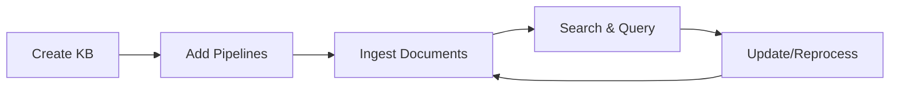

## What is a Knowledge Base?

A **Knowledge Base** is a container that organizes your documents into a searchable collection. Think of it as a specialized database designed for semantic search and AI retrieval.

<CardGroup cols={2}>
  <Card title="Organize" icon="folder-tree">
    Group related documents by project, department, or topic
  </Card>
  <Card title="Search" icon="magnifying-glass">
    Query documents using natural language
  </Card>
  <Card title="Integrate" icon="plug">
    Connect to AI tools via MCP
  </Card>
  <Card title="Scale" icon="chart-line">
    Handle thousands of documents efficiently
  </Card>
</CardGroup>

## Knowledge Base Lifecycle



## Creating a Knowledge Base

### Via API

```bash
curl -X POST http://localhost:3000/api/v2/knowledgebases \
  -H "Authorization: Bearer YOUR_JWT_TOKEN" \
  -H "Content-Type: application/json" \
  -d '{
    "name": "Product Documentation",
    "description": "Technical docs for our product suite"
  }'
```

### Response

```json
{
  "id": "550e8400-e29b-41d4-a716-446655440000",
  "name": "Product Documentation",
  "description": "Technical docs for our product suite",
  "status": "active",
  "createdAt": "2024-01-28T12:00:00.000Z",
  "updatedAt": "2024-01-28T12:00:00.000Z"
}
```

## Knowledge Base Properties

| Property | Type | Description |
|----------|------|-------------|
| `id` | UUID | Unique identifier |
| `name` | String | Display name (max 100 chars) |
| `description` | String | Optional description (max 500 chars) |
| `status` | Enum | `active` or `inactive` |
| `metadata` | Object | Custom key-value metadata |
| `createdAt` | DateTime | Creation timestamp |
| `updatedAt` | DateTime | Last update timestamp |

## Status Management

Knowledge Bases can be in one of two states:

<Tabs>
  <Tab title="Active">
    - Accepts new documents via pipelines
    - Available for search queries
    - MCP tools are registered and available
  </Tab>
  <Tab title="Inactive">
    - Pipelines are paused
    - Search is disabled
    - MCP tools are unregistered
    - Data is preserved
  </Tab>
</Tabs>

### Deactivate a Knowledge Base

```bash
curl -X PUT http://localhost:3000/api/v2/knowledgebases/{kbId}/status \
  -H "Authorization: Bearer YOUR_JWT_TOKEN" \
  -H "Content-Type: application/json" \
  -d '{"status": "inactive"}'
```

## Best Practices

<AccordionGroup>
  <Accordion title="Use descriptive names" icon="tag">
    Choose names that clearly identify the content:
    - <IconCheck /> "Q4 2024 Financial Reports"
    - <IconCheck /> "Engineering Runbooks"
    - <IconCross /> "KB1" or "Test"
  </Accordion>
  
  <Accordion title="One topic per Knowledge Base" icon="bullseye">
    Keep Knowledge Bases focused on a single domain:
    - <IconCheck /> Separate KB for HR policies and Engineering docs
    - <IconCross /> Mixing unrelated documents in one KB
  </Accordion>
  
  <Accordion title="Use metadata for organization" icon="tags">
    Add custom metadata for filtering and tracking:
    ```json
    {
      "department": "Engineering",
      "project": "IngestIQ",
      "version": "2.0"
    }
    ```
  </Accordion>
</AccordionGroup>

## Related

<CardGroup cols={2}>
  <Card title="Pipelines" icon="arrow-right" href="/core-concepts/pipelines">
    Configure data ingestion for your Knowledge Base
  </Card>
  <Card title="MCP Integration" icon="puzzle-piece" href="/integrations/mcp-server">
    Connect your KB to AI assistants
  </Card>
</CardGroup>
