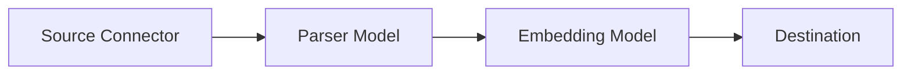

## What is a Pipeline?

A **Pipeline** is a configured workflow that defines how documents are ingested, processed, and stored in a Knowledge Base. Each pipeline connects four key components:



## Pipeline Architecture

<CardGroup cols={2}>
  <Card title="Source Connector" icon="plug">
    Where data comes from (files, web, Google Drive, video)
  </Card>
  <Card title="Parser Model" icon="wand-magic-sparkles">
    AI model for semantic chunking (Gemini, OpenAI)
  </Card>
  <Card title="Embedding Model" icon="cube">
    Generates vector embeddings (OpenAI)
  </Card>
  <Card title="Destination" icon="database">
    Where vectors are stored (pgvector)
  </Card>
</CardGroup>

## Creating a Pipeline

### Via API

```bash
curl -X POST http://localhost:3000/api/v2/knowledgebases/{kbId}/pipelines \
  -H "Authorization: Bearer YOUR_JWT_TOKEN" \
  -H "Content-Type: application/json" \
  -d '{
    "name": "PDF Document Pipeline",
    "description": "Process uploaded PDF files",
    "sourceConnectorConfigId": "uuid-of-source-config",
    "parserModelConfigId": "uuid-of-parser-config",
    "embeddingModelConfigId": "uuid-of-embedding-config",
    "destinationConnectorConfigId": "uuid-of-destination-config"
  }'
```

## Pipeline Configuration

| Field | Required | Description |
|-------|----------|-------------|
| `name` | ✅ | Pipeline name (max 255 chars) |
| `description` | ❌ | Optional description |
| `sourceConnectorConfigId` | ✅ | Source connector configuration |
| `parserModelConfigId` | ✅ | AI model for parsing |
| `embeddingModelConfigId` | ✅ | Model for embeddings |
| `destinationConnectorConfigId` | ✅ | Vector storage destination |
| `parsingPrompt` | ❌ | Custom parsing instructions |
| `metadataParsingPrompt` | ❌ | Custom metadata extraction |
| `isMetadataPrompt` | ❌ | Enable metadata extraction |

## Scheduling

Pipelines can be scheduled to run automatically:

<Tabs>
  <Tab title="Daily">
    ```json
    {
      "scheduleConfig": {
        "enable_automation": true,
        "interval_type": "Daily",
        "interval_time": "09:00",
        "timezone": "UTC"
      }
    }
    ```
  </Tab>
  <Tab title="Weekly">
    ```json
    {
      "scheduleConfig": {
        "enable_automation": true,
        "interval_type": "Weekly",
        "interval_time": "09:00",
        "day_of_week": "Monday",
        "timezone": "America/New_York"
      }
    }
    ```
  </Tab>
  <Tab title="Monthly">
    ```json
    {
      "scheduleConfig": {
        "enable_automation": true,
        "interval_type": "Monthly",
        "interval_time": "09:00",
        "date_of_month": 1,
        "timezone": "Europe/London"
      }
    }
    ```
  </Tab>
</Tabs>

<Note>
  Scheduling requires `ENABLE_SCHEDULER=true` in your environment configuration.
</Note>

## Executing a Pipeline

### Manual Execution

Execute a pipeline immediately:

```bash
curl -X POST http://localhost:3000/api/v2/knowledgebases/{kbId}/pipelines/{pipelineId}/execute \
  -H "Authorization: Bearer YOUR_JWT_TOKEN" \
  -H "Content-Type: application/json" \
  -d '{
    "files": [/* file data */]
  }'
```

### Execution Status

Each execution creates a tracking record:

| Status | Description |
|--------|-------------|
| `pending` | Execution queued |
| `processing` | Currently processing |
| `completed` | Successfully finished |
| `partial_failed` | Some documents failed |
| `failed` | Execution failed |

### View Execution History

```bash
curl http://localhost:3000/api/v2/knowledgebases/{kbId}/pipelines/{pipelineId}/executions \
  -H "Authorization: Bearer YOUR_JWT_TOKEN"
```

## Custom Prompts

Customize how documents are parsed:

### Parsing Prompt

Control how the AI chunks your documents:

```json
{
  "parsingPrompt": "Extract information focusing on: \n1. Key definitions\n2. Code examples\n3. Step-by-step instructions\nPreserve code blocks exactly as written."
}
```

### Metadata Extraction

Extract structured metadata from documents:

```json
{
  "isMetadataPrompt": true,
  "metadataParsingPrompt": "Extract: title, author, date, keywords, summary (max 200 words)"
}
```

## Pipeline Status

| Status | Description |
|--------|-------------|
| `active` | Pipeline is enabled and can be executed |
| `inactive` | Pipeline is disabled |

## Best Practices

<AccordionGroup>
  <Accordion title="Use specific parsing prompts" icon="lightbulb">
    Tailor your parsing prompt to your document type:
    - **Legal docs**: Focus on clauses, definitions, obligations
    - **Technical docs**: Preserve code, command examples
    - **Research papers**: Extract citations, methodology, findings
  </Accordion>
  
  <Accordion title="Monitor execution history" icon="chart-line">
    Regularly check execution status to catch failures early.
  </Accordion>
  
  <Accordion title="Test before scheduling" icon="flask">
    Run manual executions before enabling scheduled runs.
  </Accordion>
</AccordionGroup>

## Related

<CardGroup cols={2}>
  <Card title="Data Connectors" icon="plug" href="/core-concepts/connectors">
    Available source and destination connectors
  </Card>
  <Card title="AI Models" icon="wand-magic-sparkles" href="/ai-processing/ai-models">
    Configure parser and embedding models
  </Card>
</CardGroup>
