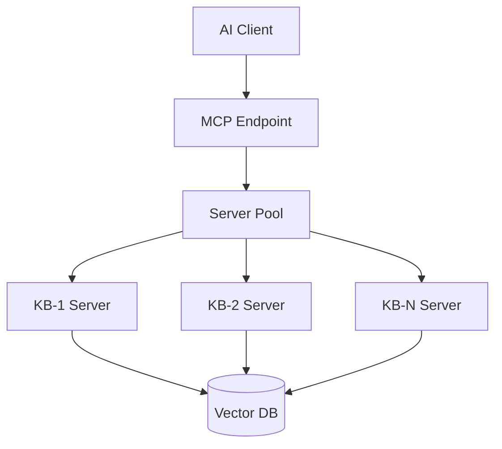

## What is MCP?

The **Model Context Protocol (MCP)** is an open standard that allows AI applications to connect to external data sources. IngestIQ's MCP server exposes your Knowledge Bases as tools that AI assistants can use.

<CardGroup cols={2}>
  <Card title="Knowledge Base Tools" icon="database">
    Each KB becomes a searchable tool
  </Card>
  <Card title="AI Integration" icon="wand-magic-sparkles">
    Works with Claude, Cursor, and more
  </Card>
  <Card title="High Performance" icon="bolt">
    Server pooling for scalability
  </Card>
  <Card title="Isolation" icon="shield">
    Per-KB tool isolation
  </Card>
</CardGroup>

## Architecture



IngestIQ uses a **server pool architecture**:
- Each Knowledge Base gets a dedicated MCP server
- Servers are cached and reused for performance
- Automatic cleanup of idle servers

## API Endpoints

### MCP Protocol Endpoint

```http
POST /mcp/:knowledgebaseId
Content-Type: application/json

{
  "jsonrpc": "2.0",
  "method": "tools/list",
  "id": 1
}
```

### List Available Tools

```bash
curl -X POST http://localhost:3000/mcp/{knowledgebaseId} \
  -H "Content-Type: application/json" \
  -d '{
    "jsonrpc": "2.0",
    "method": "tools/list",
    "id": 1
  }'
```

Response:
```json
{
  "jsonrpc": "2.0",
  "id": 1,
  "result": {
    "tools": [
      {
        "name": "search-engineering-docs",
        "description": "Search the Engineering Documentation knowledge base",
        "inputSchema": {
          "type": "object",
          "properties": {
            "query": { "type": "string" },
            "topK": { "type": "number" }
          }
        }
      }
    ]
  }
}
```

### Execute a Tool

```bash
curl -X POST http://localhost:3000/mcp/{knowledgebaseId} \
  -H "Content-Type: application/json" \
  -d '{
    "jsonrpc": "2.0",
    "method": "tools/call",
    "params": {
      "name": "search-engineering-docs",
      "arguments": {
        "query": "How to configure authentication?",
        "topK": 5
      }
    },
    "id": 2
  }'
```

## Knowledge Base Tools

Each Knowledge Base automatically creates MCP tools based on its configured **Knowledge Base Tools**.

### Creating Custom Tools

```bash
curl -X POST http://localhost:3000/api/v2/knowledgebases/{kbId}/tools \
  -H "Authorization: Bearer YOUR_JWT_TOKEN" \
  -H "Content-Type: application/json" \
  -d '{
    "name": "search-product-docs",
    "description": "Search product documentation for user guides and FAQs",
    "queryPrefix": "",
    "topK": 10,
    "scoreThreshold": 0.7
  }'
```

### Tool Properties

| Property | Description |
|----------|-------------|
| `name` | Tool identifier (used in MCP calls) |
| `description` | What the tool does (shown to AI) |
| `queryPrefix` | Optional prefix for all queries |
| `topK` | Number of results to return |
| `scoreThreshold` | Minimum similarity score |

## Client Configuration

### Claude Desktop

Add to your Claude Desktop `claude_desktop_config.json`:

```json
{
  "mcpServers": {
    "ingestiq-engineering": {
      "command": "curl",
      "args": [
        "-X", "POST",
        "http://localhost:3000/mcp/YOUR_KB_ID",
        "-H", "Content-Type: application/json"
      ]
    }
  }
}
```

### Cursor AI

In Cursor settings, add MCP server:

```json
{
  "mcp": {
    "servers": {
      "ingestiq": {
        "url": "http://localhost:3000/mcp/YOUR_KB_ID"
      }
    }
  }
}
```

### Generic MCP Client

Any MCP-compatible client can connect using:
- **Endpoint**: `http://localhost:3000/mcp/{knowledgebaseId}`
- **Protocol**: JSON-RPC 2.0
- **Content-Type**: application/json

## Monitoring

### Get KB Server Status

```bash
curl http://localhost:3000/mcp/{knowledgebaseId}/status
```

Response:
```json
{
  "knowledgebaseId": "kb-uuid",
  "hasServer": true,
  "serverStatus": {
    "isInitialized": true,
    "activeConnections": 2
  }
}
```

### Get Pool Status

```bash
curl http://localhost:3000/mcp/pool/status
```

Response:
```json
{
  "poolStats": {
    "totalServers": 5,
    "activeConnections": 12
  },
  "knowledgeBaseIds": ["kb-1", "kb-2", "kb-3"],
  "serverCount": 3
}
```

## Configuration

### Environment Variables

```env
MCP_MAX_SERVERS=100
MCP_MAX_IDLE_TIME=1800000    # 30 minutes
MCP_CLEANUP_INTERVAL=300000  # 5 minutes
```

### Server Pool Settings

| Setting | Default | Description |
|---------|---------|-------------|
| `maxServers` | 100 | Maximum cached servers |
| `maxIdleTime` | 30 min | Idle timeout before cleanup |
| `cleanupInterval` | 5 min | How often to clean idle servers |

## Performance

### Latency

| Scenario | Expected Latency |
|----------|------------------|
| First request (new KB) | 50-100ms |
| Subsequent requests | 5-20ms |
| Tool execution | Varies by query |

### Memory

| Component | Memory Usage |
|-----------|--------------|
| Per server | 2-5MB |
| Pool overhead | &lt;1MB |
| Per connection | ~1KB |

## Best Practices

<AccordionGroup>
  <Accordion title="Create descriptive tool names">
    ```
    ✅ "search-engineering-runbooks"
    ✅ "query-customer-faqs"
    ❌ "search" (too generic)
    ```
  </Accordion>
  
  <Accordion title="Write helpful descriptions">
    Descriptions help AI understand when to use the tool:
    ```
    "Search engineering runbooks for deployment procedures, 
     incident response, and infrastructure documentation"
    ```
  </Accordion>
  
  <Accordion title="Set appropriate topK">
    - More results = more context for AI
    - Fewer results = faster, more focused
    - Default: 5-10 for most use cases
  </Accordion>
</AccordionGroup>

## Troubleshooting

| Issue | Cause | Solution |
|-------|-------|----------|
| Tool not found | KB not initialized | Make first request to initialize |
| Slow responses | Server not cached | First request creates server |
| Empty results | Low score threshold | Lower `scoreThreshold` |
| Connection error | Invalid KB ID | Verify Knowledge Base exists |

## Related

<CardGroup cols={2}>
  <Card title="Knowledge Bases" icon="database" href="/core-concepts/knowledge-bases">
    Create and manage KBs
  </Card>
  <Card title="Search API" icon="magnifying-glass" href="/api-reference/search">
    Direct search API
  </Card>
</CardGroup>
