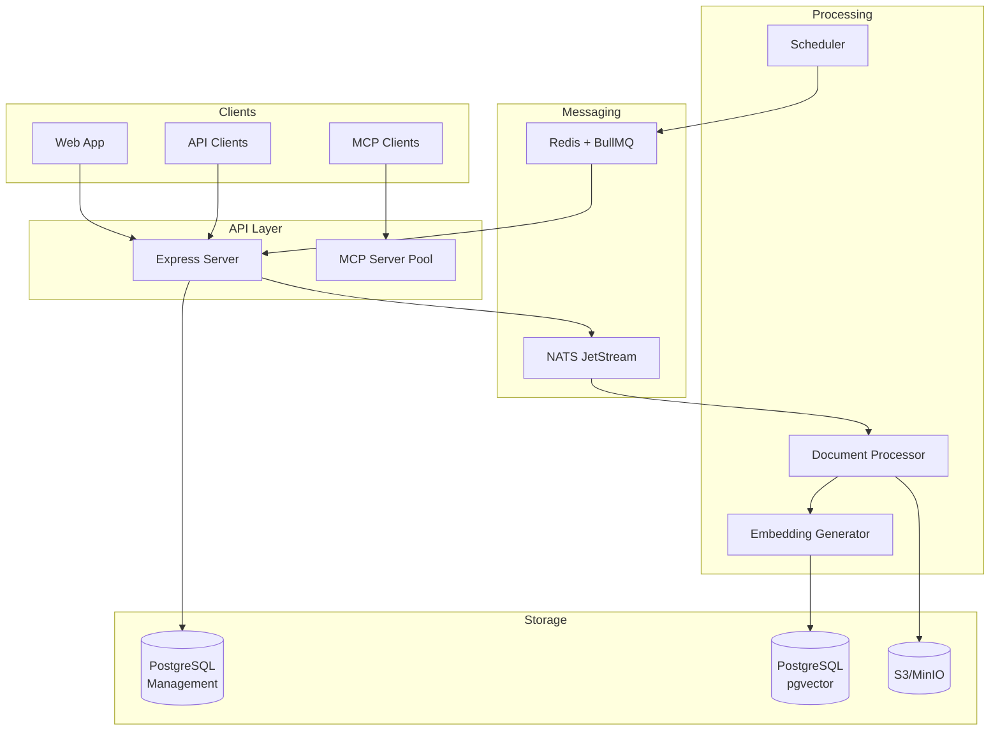
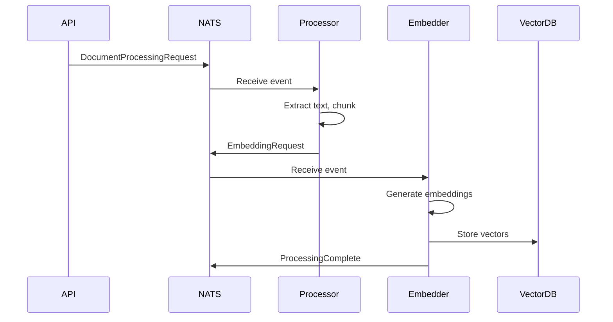
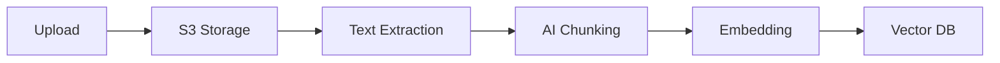
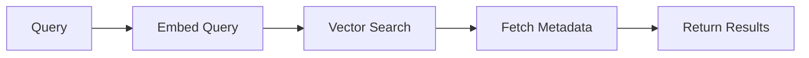

## Overview

IngestIQ is built on **Clean Architecture** principles with an event-driven microservices design.

## High-Level Architecture



## Clean Architecture Layers

```
┌─────────────────────────────────────┐
│        Presentation Layer           │
│  (Controllers, Routes, Middleware)  │
├─────────────────────────────────────┤
│        Application Layer            │
│      (Use Cases, Services)          │
├─────────────────────────────────────┤
│          Domain Layer               │
│   (Entities, Interfaces, Errors)    │
├─────────────────────────────────────┤
│       Infrastructure Layer          │
│  (Repositories, External Services)  │
└─────────────────────────────────────┘
```

### Layer Responsibilities

| Layer | Responsibility |
|-------|----------------|
| **Presentation** | HTTP handling, validation, response formatting |
| **Application** | Business logic, orchestration, use cases |
| **Domain** | Core entities, business rules, interfaces |
| **Infrastructure** | Database, external APIs, storage |

## Project Structure

```
src/
├── presentation/     # HTTP Layer
│   ├── controllers/  # Request handlers
│   ├── routes/       # Route definitions
│   ├── middleware/   # Auth, validation
│   └── schemas/      # Request validation
│
├── application/      # Business Logic
│   └── useCases/     # Feature implementations
│       ├── auth/
│       ├── document/
│       ├── knowledgebase/
│       └── pipeline/
│
├── domain/           # Core Business
│   ├── entities/     # Domain objects
│   ├── interfaces/   # Repository contracts
│   └── errors/       # Domain errors
│
├── infrastructure/   # External Integrations
│   ├── repository/   # Database implementations
│   └── services/     # External service adapters
│
├── common/           # Shared Utilities
│   ├── ai/           # AI provider factory
│   ├── db/           # Database setup
│   ├── embedding/    # Embedding providers
│   └── storage/      # S3 storage
│
├── mcp/              # MCP Server
├── nats-events/      # Event handlers
└── scheduler/        # Job scheduling
```

## Event-Driven Processing

Document processing is fully asynchronous via NATS JetStream:



### Event Types

| Event | Purpose |
|-------|---------|
| `document.processing.request` | Start document processing |
| `document.embedding.request` | Generate embeddings |
| `document.processing.complete` | Processing finished |
| `document.processing.failed` | Processing error |

## Data Flow

### Document Ingestion



### Search Query



## Component Details

### PostgreSQL + pgvector

- **HNSW indexing** for fast approximate nearest neighbor
- Supports millions of vectors
- Metadata filtering alongside vector search

### NATS JetStream

- Durable message streaming
- At-least-once delivery
- Consumer groups for scaling

### BullMQ + Redis

- Scheduled job execution
- Retry with backoff
- Job status tracking

### MCP Server Pool

- Per-Knowledge Base server isolation
- Connection pooling
- Automatic cleanup

## Scaling Considerations

### Horizontal Scaling

| Component | Scaling Strategy |
|-----------|------------------|
| API Server | Multiple instances behind load balancer |
| Document Processor | Consumer groups in NATS |
| Database | Read replicas, connection pooling |
| Object Storage | S3/MinIO handles natively |

### Bottlenecks

| Bottleneck | Solution |
|------------|----------|
| Embedding generation | Batch processing, caching |
| Database writes | Connection pooling, async commits |
| File storage | CDN, distributed storage |

## Security Architecture

- **JWT authentication** with refresh tokens
- **Organization-level isolation**
- **Role-based access control**
- **API key encryption** at rest

## Related

<CardGroup cols={2}>
  <Card title="Deployment" icon="rocket" href="/self-hosting/deployment">
    Deploy IngestIQ
  </Card>
  <Card title="Configuration" icon="gear" href="/self-hosting/configuration">
    Environment setup
  </Card>
</CardGroup>
